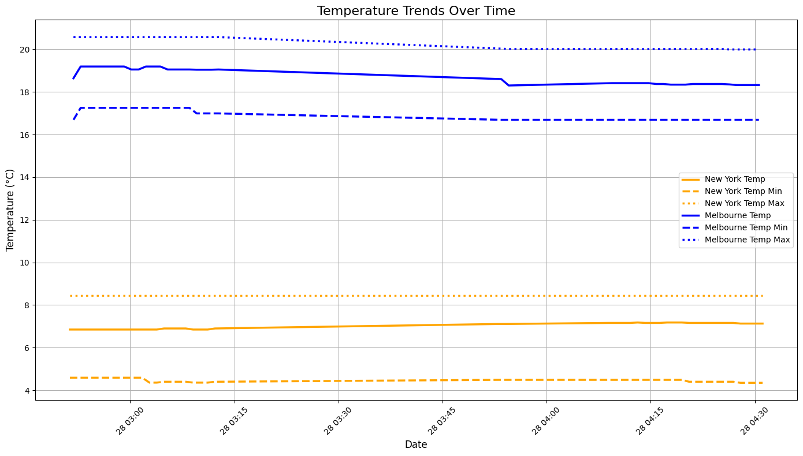
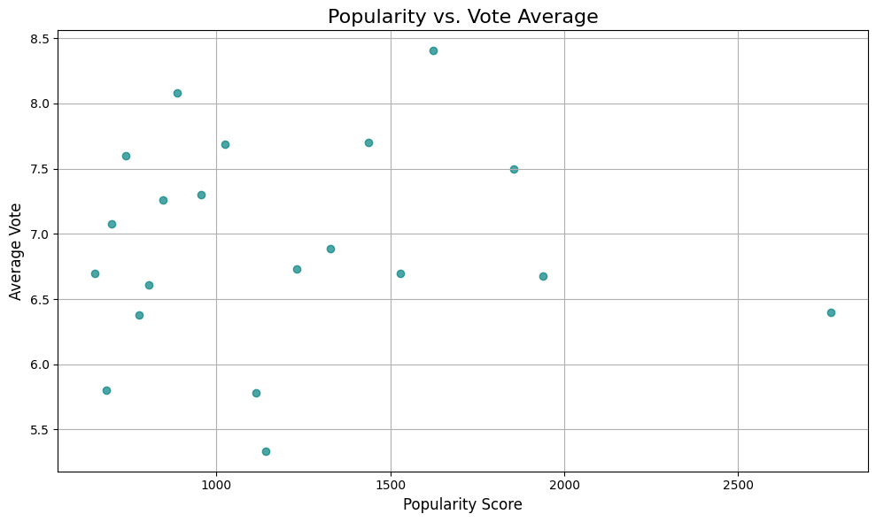

# Data Pipeline with Docker


## Overview
This project implements a Dockerized data pipeline that integrates multiple big data technologies to process, store, and analyze diverse datasets. The pipeline includes:

- **Apache Kafka**: A distributed streaming platform for real-time data ingestion.
- **Apache Cassandra**: A NoSQL database for scalable and high-performance data storage.
- **Jupyter Notebook**: A robust environment for data analysis and visualization.

The pipeline processes datasets from three APIs:
- **OpenWeatherMap API**: Streams real-time weather data for selected cities.
- **Faker API**: Generates synthetic data with customizable fields for testing and analysis.
- **The Movie Database (TMDB) API**: Collects movie-related metadata for comprehensive insights.

By integrating real-time and synthetic data sources, this project demonstrates the practical application of modern data engineering tools to handle, store, and visualize large datasets for actionable insights.


## Instructions
You need to apply for some APIs to use with this. The APIs might take days for application to be granted access. Sample API keys are given, but it can be blocked if too many users are running this.

- OpenWeatherMap API: https://openweathermap.org/api
- Faker API: https://faker.readthedocs.io/en/master/providers.html
- The Movie Database (TMDB): https://www.themoviedb.org/

Note: After obtaining the OpenWeatherMap API keys, please update the files "owm-producer/openweathermap_service.cfg" accordingly.

### Create Docker Networks
```bash
$ docker network create kafka-network          # Create network for Kafka services.
$ docker network create cassandra-network      # Create network for Cassandra services.
$ docker network ls                            # Verify network creation.
```

### Starting Cassandra and Kafka
```bash
$ docker-compose -f cassandra/docker-compose.yml up -d  # Start Cassandra.
$ docker-compose -f kafka/docker-compose.yml up -d      # Start Kafka.
$ docker ps -a                                          # Check running containers.
```

### Access Kafka UI Frontend
- **Open the Kafka UI:**
    - Navigate to http://localhost:9000 in your web browser.
    - Use the following credentials to log in:
        - **Username:** `admin`
        - **Password:** `bigbang`

- **Add a Data Pipeline Cluster:**
    - After logging in, click on the option to add a new cluster.
    - Enter the following details:
        - **Cluster Name:** `MyCluster`
        - **Cluster Zookeeper:** `zookeeper:2181`
    - Save the configuration to connect the cluster to the UI.

### Starting Cassandra Sinks
You have to manually go to CLI of the "kafka-connect" container and run the below comment to start the Cassandra sinks.
```bash
./start-and-wait.sh
```

### Starting Producers
```bash
$ docker-compose -f owm-producer/docker-compose.yml up -d   # Start OpenWeatherMap producer.
$ docker-compose -f faker-producer/docker-compose.yml up -d # Start Faker producer.
$ docker-compose -f tmdb-producer/docker-compose.yml up -d  # Start TMDB producer.
```

### Starting Consumers
```bash
$ docker-compose -f consumers/docker-compose.yml up -d     # Start Kafka consumers.
```

### Querying Data in Cassandra
First login into Cassandra's container with the following command or open a new CLI from Docker Desktop if you use that.
```bash
$ docker exec -it cassandra bash                        # Access Cassandra container.
```
Once loged in, bring up cqlsh with this command and query weatherreport, fakerdata and movies tables like this:
```bash
$ cqlsh --cqlversion=3.4.4 127.0.0.1                   # Make sure you use the correct cqlversion
cqlsh> desc keyspaces;                                 # View databases.
cqlsh> use kafkapipeline;                              # Switch to kafkapipeline keyspace.
cqlsh> desc tables;                                    # View tables.
cqlsh:kafkapipeline> select * from weatherreport;      # Query data from weatherreport table.
cqlsh:kafkapipeline> select * from fakerdata;          # Query data from fakerdata table.
cqlsh:kafkapipeline> select * from movies;             # Query data from movies table.
```

### Visualization
Run the following command then go to http://localhost:8888 and run the visualization notebook accordingly
```bash
$ docker-compose -f data-vis/docker-compose.yml up -d  # Start Jupyter Notebook.
```

### Teardown
To stop all running kakfa cluster services:
```bash
$ docker-compose -f data-vis/docker-compose.yml down           # Stop visualization
$ docker-compose -f consumers/docker-compose.yml down          # Stop consumers
$ docker-compose -f owm-producer/docker-compose.yml down       # Stop owm producer
$ docker-compose -f faker-producer/docker-compose.yml down     # Stop faker producer
$ docker-compose -f tmdb-producer/docker-compose.yml down      # Stop tmdb producer
$ docker-compose -f kafka/docker-compose.yml down              # Stop kafka
$ docker-compose -f cassandra/docker-compose.yml down          # Stop cassandra
```
To remove the kafka and cassandra network:
```bash
$ docker network rm kafka-network            # Remove kafka network
$ docker network rm cassandra-network        # Remove cassandra network
```
To remove resources in Docker:
```bash
$ docker container prune    # Remove stopped containers
$ docker volume prune       # Remove all volumes
$ docker image prune -a     # Remove all images
$ docker builder prune      # Remove all build cache
$ docker system prune -a    # Remove everything
```

## The Movie Database (TMDB) API
The The Movie Database (TMDB) API is a popular and robust service that provides access to a wide range of movie, TV show, and actor-related metadata. It is widely used in projects involving entertainment data and analytics due to its comprehensive and regularly updated database.


### 1. Features
- **Movie Data**: Retrieve details about movies, including titles, release dates, genres, and ratings.
- **TV Show Data**: Access information about TV series, episodes, and seasons.
- **Actor Data**: Get biographical and filmography details for actors and crew members.
- **Search Functionality**: Search for movies, TV shows, or people by name or ID.
- **Popular and Trending Data**: Fetch lists of trending movies, TV shows, and actors.

### 2. Usage in the Project
In this project, the The Movie Database (TMDB) API is used to:
- Stream movie-related metadata into the Kafka pipeline.
- Store the processed data in Cassandra for structured analysis.
- Generate insights and visualizations in Jupyter Notebook.

### 3. API Access
To use the The Movie Database (TMDB) API:
- Sign up for an account at https://www.themoviedb.org/
- Obtain your API key from the account settings.
- Configure the `tmdb_producer.py` script with your API key to start collecting data.

For more details, visit the https://developers.themoviedb.org/3/getting-started/introduction


## Data Visualization & Analysis
### 1. OWM - Temperature Trends Over Time

This plot visualizes temperature trends for New York and Melbourne over a specific time period, highlighting current, minimum, and maximum temperatures. The data, collected using the OpenWeatherMap API, reveals that Melbourne consistently has higher and more stable temperatures compared to New York, which shows slightly more fluctuation in its minimum and maximum values. This reflects the seasonal and geographical differences between the two cities. The steady trends for both cities suggest stable weather conditions during the observed period, with no significant day-night variations evident in this dataset.

### 2. OWM - Average Temperature Comparison

This bar chart compares the average temperatures between Melbourne and New York based on data collected from the OpenWeatherMap API. The x-axis represents the cities, while the y-axis shows the average temperature in degrees Celsius (°C). Melbourne exhibits a significantly higher average temperature (~17.5°C) compared to New York (~7.5°C). This difference underscores the contrasting climates of the two cities, influenced by their geographical and seasonal contexts.

### 3. OWM - Humidity Trends Over Time

The humidity trends plot illustrates the variations in humidity levels for New York and Melbourne over time. Melbourne exhibits consistently higher humidity levels, fluctuating between 85% and 90%, whereas New York maintains a stable humidity around 60%. This stark contrast highlights the climatic differences between the two cities, with Melbourne showing a humid atmosphere typical of its geographic and seasonal conditions, while New York's drier environment reflects a relatively stable and less humid climate. These insights help in understanding the environmental characteristics of each city.

### 4. OWM - Humidity Trends Over Time

The wind speed distribution histogram compares the frequency of wind speeds (in m/s) for New York and Melbourne. Melbourne shows a concentration of wind speeds around 2.0 m/s, with significantly higher occurrences compared to New York. Conversely, New York exhibits a broader distribution of wind speeds, with peaks at both 1.6 m/s and 2.6 m/s. This visualization highlights that Melbourne generally experiences more consistent and moderate wind speeds, while New York's wind speeds are more variable. These differences reflect the contrasting meteorological conditions of the two cities, which could influence local weather patterns and environmental factors.

### 5. OWM - Temperature vs. Humidity

The scatter plot illustrates the relationship between temperature (°C) and humidity (%) for New York and Melbourne. New York (blue points) is clustered at lower temperatures (~7–8°C) with stable humidity levels around 60%. Melbourne (orange points) is concentrated at higher temperatures (~17–19°C) with higher humidity levels, ranging between 85% and 90%. The plot clearly highlights the contrasting climates of the two cities, with New York exhibiting a cooler and drier environment, while Melbourne experiences warmer and more humid conditions. This comparison provides insights into how temperature and humidity correlate differently based on geographic and seasonal factors.

### 6. TMDB - Top 10 Rated Movies

The horizontal bar chart displays the Top 10 Rated Movies based on their average vote scores from The Movie Database (TMDB). The x-axis represents the average vote score, while the y-axis lists the movie titles. The chart shows that "The Wild Robot" has the highest average vote among the top 10, followed by "Transformers One" and "Wicked." These high ratings indicate their popularity and positive reception. The visualization provides a clear ranking of movies, enabling easy comparison of their average ratings, and highlights trends in viewer preferences and critical acclaim within the dataset.

### 7. TMDB - Top 10 Most Popular Movies

The horizontal bar chart displays the Top 10 Most Popular Movies based on their popularity scores from The Movie Database (TMDB). The x-axis represents the popularity score, and the y-axis lists the movie titles. "Venom: The Last Dance" ranks the highest in popularity, followed by "Smile 2" and "Moana 2." These high scores reflect audience interest and engagement, possibly influenced by recent releases, promotions, or franchise popularity. The chart effectively highlights the most sought-after movies, providing insights into current trends in the film industry.

### 8. TMDB - Movie Releases by Year

The line chart visualizes the trend of Movie Releases by Year over time, showing the number of movies released each year. The x-axis represents the years, while the y-axis displays the number of releases. The chart demonstrates a steady increase in movie releases from 2010 to 2024, with a noticeable growth trend over the years. This upward trajectory indicates the expanding volume of movie productions, possibly driven by advancements in technology, higher demand for entertainment content, and the rise of streaming platforms. The visualization provides insight into how the film industry has grown consistently over the past decade.

### 9. TMDB - Vote Average Distribution

The histogram illustrates the Vote Average Distribution for movies, based on their average rating scores from The Movie Database (TMDB). The x-axis represents the average vote score, while the y-axis shows the frequency of movies falling within each score range. The distribution is centered around a peak at an average vote of 6.5, indicating that most movies in the dataset have moderate ratings. The spread includes lower frequencies for highly rated movies (above 7.5) and lower-rated movies (below 6.0). This visualization provides insights into the general quality and reception of movies, with the majority receiving average to slightly above-average ratings.

### 10. TMDB - Popularity vs. Vote Average

The scatter plot illustrates the relationship between Popularity Score and Average Vote for movies. The x-axis represents the popularity score, while the y-axis shows the average vote. The distribution reveals no strong linear correlation between these two metrics, indicating that a high popularity score does not necessarily translate to a high average vote. For instance, some movies with moderate popularity scores achieve higher ratings, while others with high popularity scores have average or lower ratings. This visualization highlights that factors driving popularity, such as marketing or franchise appeal, may differ from those influencing critical acclaim or viewer satisfaction.

## Practical Implication of the Project

This project demonstrates how big data analysis can address real-world challenges by efficiently collecting, processing, storing, and analyzing large datasets in real time. By integrating APIs like OpenWeatherMap, Faker, and The Movie Database (TMDB), the project highlights the practical applications of big data in solving specific problems across different domains.

### 1. Practical Problem and Solution
- **Weather Monitoring and Climate Analysis**:
   - **Problem**: Real-time weather monitoring is essential for disaster preparedness, urban planning, and agriculture, yet traditional systems often struggle with processing large-scale, real-time weather data.
   - **Solution**: Using the OpenWeatherMap API, this project streams and analyzes weather data such as temperature, humidity, and wind speed. Big data analysis helps detect patterns and trends, providing actionable insights for stakeholders to mitigate risks and optimize decision-making processes.

- **Synthetic Data Generation for Testing**:
   - **Problem**: Organizations often lack access to large, realistic datasets for system testing, model training, or prototyping, especially when working with sensitive information.
   - **Solution**: The Faker API generates realistic, synthetic data, enabling efficient system testing and prototyping without exposing sensitive data. This ensures data privacy while providing high-quality test cases for applications.

- **Understanding Entertainment Industry Trends**:
   - **Problem**: Predicting audience preferences and identifying trends in the entertainment industry is challenging due to the massive volume of data from movies, ratings, and popularity scores.
   - **Solution**: Leveraging the TMDB API, this project analyzes movie ratings, popularity scores, and release trends. Big data analysis helps stakeholders understand audience preferences, identify successful patterns, and optimize marketing and release strategies.

### 2. Role of Big Data Analysis
- **Real-Time Processing**: Apache Kafka allows continuous data streaming, enabling real-time insights for dynamic decision-making.
- **Scalable Storage**: Apache Cassandra ensures efficient storage and quick querying of large volumes of data, supporting scalability and high availability.
- **Actionable Visualizations**: Jupyter Notebook transforms raw data into meaningful visualizations, helping stakeholders interpret trends and patterns effectively.
- **Automation**: The automated data pipeline reduces manual effort, ensuring reliable and consistent workflows.

This project demonstrates the power of big data analysis in solving practical problems, from weather forecasting and software testing to understanding audience preferences in the entertainment industry. By providing a scalable, real-time pipeline, the project offers a versatile template for handling complex datasets and deriving actionable insights to address real-world challenges.


## Demonstration Video
Link: https://youtu.be/zkvS1EwdiVQ?si=i8SJPoVvAxX_2hRs